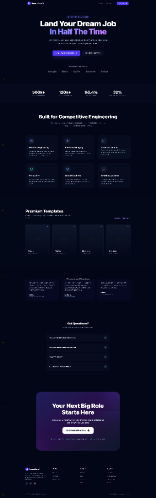

# ResumeForge AI 🚀

**Land more interviews by letting AI tailor your resume to every job — in seconds.**



ResumeForge AI is a premium, AI-powered resume optimization platform designed for modern tech professionals. It analyzes your existing resume alongside any job description to produce a high-converting, job-tailored resume optimized for both ATS screening and human recruiters.

---

## ✨ Key Features

- 🎨 **Visual WYSIWYG Editor**: A rich TipTap-based editor that lets you format your resume visually with bolding, lists, and highlighting.
- 🎭 **Premium Templates**: Instantly switch between **Classic, Modern, Minimalist, and Executive** styles.
- 👀 **Live Preview**: Real-time "Page-on-Desk" preview synchronized with your edits.
- 🎯 **AI-Driven Optimization**: Powered by Google Gemini to inject perfect keywords and bridge skill gaps.
- ⚡ **Sub-Minute Forging**: Generate a perfectly tailored draft from any PDF/DOCX in under 30 seconds.
- 💎 **Smart Badges**: Automatic coloring of key skills and technologies for maximum impact.
- 📥 **Enterprise Export**: High-fidelity PDF and DOCX downloads ready for submission.

---

## 🗺️ How It Works

1. **Upload Content** — Drop in your current resume or paste your professional history.
2. **Target Your Role** — Paste the job description you're aiming for.
3. **AI Forging** — Let Gemini AI tailor the content and optimize for ATS compatibility.
4. **Visual Polish** — Use the premium editor to make final touches and select your ideal template.
5. **Download** — Export your high-priority PDF and start applying!

---

## 🚀 Technical Stack

### Frontend
- **Framework**: Next.js 16 (App Router)
- **Styling**: Tailwind CSS 4
- **Editor**: TipTap (Headless WYSIWYG)
- **State**: Zustand (with persistence)
- **Icons**: Lucide React

### Backend
- **Framework**: NestJS
- **AI Engine**: Google Gemini Pro
- **Queue**: BullMQ (with Redis)
- **Database**: PostgreSQL (Prisma)
- **Exports**: html2pdf.js & docx.js

---

## 🏗️ Project Structure

```
resumeforge-ai/
├── apps/
│   ├── web/        # Next.js 16 App — Visual Editor & UI
│   └── api/        # NestJS API — AI Logic & PDF Generation
├── packages/
│   └── types/      # Shared TypeScript types
└── package.json    # Monorepo configuration
```

---

## 💡 Get Started

### Prerequisites
- [Node.js 18+](https://nodejs.org)
- [PostgreSQL](https://www.postgresql.org)
- [Redis](https://redis.io)

### Local Setup
1. **Install dependencies**: `npm install`
2. **Configure environment**: Set up `.env` files in both `apps/web` and `apps/api`.
3. **Run development**: `npm run dev`

Access the portal at **http://localhost:3000**.

---

## 🤝 Contributing

Contributions are welcome! Please open an issue or submit a pull request.

---

## 📄 License

MIT License. See [LICENSE](file:///Users/femisowemimo/Documents/GitHub/resumeforge-ai/LICENSE) for details.
